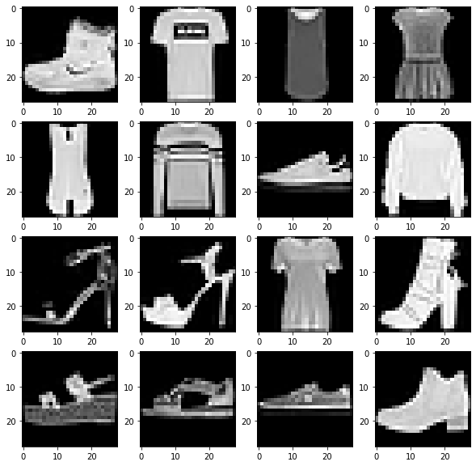

# Multi Layer Perceptron
이 레파지토리는 Multi Layer Perceptron, MLP를 이용하여 모델을 구성하고 결과를 살펴보도록하겠다.

# 실습해볼 내용
### 1. Dataset
  : 케라스에서 제공하는 이미지 데이터셋을 이용<br>
```python
    fashion_mnist = tf.keras.datasets.fashion_mnist
    (x_train, y_train), (x_test, y_test) = fashion_mnist.load_data()
```
  


### 2. Model 구성

```python
class MLP(tf.keras.Model):
    def __init__(self, input_dim: int, h1_dim: int, h2_dim: int, out_dim: int):
        # tf.keras.Model 과 사용할 속성 정의
        super().__init__()
        self.flatten = tf.keras.layers.Flatten()
        self.linear1 = tf.keras.layers.Dense(input_dim = input_dim, units = h1_dim)
        self.linear2 = tf.keras.layers.Dense(units= h2_dim)
        self.linear3 = tf.keras.layers.Dense(units= out_dim)        
        self.relu = tf.nn.relu
        
    # training 학습일때는 dropout을 키고 test에서는 끄도록 조정, 사실 model.fit()에서는 자동으로 true를 사용해서 설정할 필요없다.
    def call(self, input, training = False):
        x = self.flatten(input)
        x = self.relu(self.linear1(x))
        x = self.relu(self.linear2(x))
        out = self.linear3(x)
        out = tf.nn.softmax(out)
        return out
    
    # 아래의 과정들은 공부를 위한 오버라이딩이며 굳이 적지 않아도 된다.
    def train_step(self, data):
        images, labels = data

        with tf.GradientTape() as tape:
            outputs = self(images, training=True)
            preds = tf.argmax(outputs, 1)
            
            loss = self.compiled_loss(labels, outputs)
            
        # gradients 계산
        trainable_vars = self.trainable_variables
        gradients = tape.gradient(loss, trainable_vars)
        
        # update weights
        self.optimizer.apply_gradients(zip(gradients, trainable_vars))
            
        # update metrics
        self.compiled_metrics.update_state(labels, preds)
        
        logs = {m.name: m.result() for m in self.metrics}
        logs.update({'loss' : loss})
        # return a dict mapping metrics name to current values
        return logs
        
    def test_step(self, data):
        images, labels = data
        outputs = self(images, training=False)
        preds = tf.argmax(outputs, 1)
        loss = self.compiled_loss(labels, outputs)
        self.compiled_metrics.update_state(labels, preds)

        # return a dict mapping metrics name to current values
        logs = {m.name: m.result() for m in self.metrics}
        logs.update({'test_loss' : loss})
        return logs
```
